**Малая творческая студия из двух человек.**
Делаем истории, игры и инструменты — книги, Unity-игры, десктоп-приложения,
devkit для Claude Code и Telegram-ботов.

<!-- TODO(автор): подставь реальные публичные ссылки -->
[🌐 Сайт](https://candycate.studio) · [✈️ Telegram](https://t.me/candycate) · [✉️ Написать](mailto:hello@candycate.studio)

---

## 🧭 Что мы делаем

CandyCate — про разнородные, но связанные вещи: готическое зимнее романтези,
уютные головоломки на Unity, инструменты под собственный рабочий процесс.
Один Org, чистая структура, единый workflow — мета-слой пропорционален продукту.

## 🗂️ Направления

### 📖 Книги и нарратив
| Проект | О чём |
|---|---|
| **«Изумрудная ночь»** | Готическое зимнее романтези: уличная девчонка под личиной парня и проклятый граф-оборотень, чей белый волк раз в год рассыпает по городу изумруды. |
| **narrative-studio** | Координатор домена — база знаний письма, generic сайт-инструмент книги, канон-схема. |

### 🎮 Игры на Unity
| Проект | О чём |
|---|---|
| **Merge-2 «Ведьма, кот и демон»** | Мердж-головоломка: варим блюда по рецептам, выполняем заказы, обустраиваем ведьмину лавку. |
| **unity-studio · template · Core-packages** | Монорепо-координатор + шаблон проекта + 23 переиспользуемых Core-UPM-пакета. |

### 🖥️ Приложения
| Проект | О чём |
|---|---|
| **Focus Flow** | Десктоп-приложение для фокуса и продуктивности. |

### 🛠️ Devkit для Claude Code
| Проект | О чём |
|---|---|
| **devkit-marketplace** | Маркетплейс плагинов и скиллов: Unity-ревью, git-flow, prompt-refiner, build-hygiene и другие. |
| **devkit-unity-mcp** | MCP-мост Claude ↔ Unity Editor. |
| **devkit-release-notify** | Общий notify-движок (changelog → Telegram) для всех репозиториев студии. |

### 🤖 Telegram-боты
| Проект | О чём |
|---|---|
| **bot-badge** | Генератор SVG-бейджей статуса (фаза + версия) репозиториев студии. |
| **bot-unity-builds** | Уведомления о новых билдах игр с чейнджлогом *(в планах)*. |

---

## 📈 Пульс студии

<!-- Кастомный виджет: агрегат коммит-активности по ВСЕМ репо Org за год (см. workflow) -->

🐍 Агрегат коммит-активности по всем репозиториям студии за год · обновляется по расписанию. У организаций нет графа контрибуций, поэтому виджет собран под нас.

<!-- Карточка метрик организации (lowlighter/metrics): активность, языки, репозитории -->

📊 Метрики организации candycate-studio · обновляется по расписанию.

---

## 🧰 Собрано на

---

Продуктовые репозитории приватные — эта страница-витрина рассказывает о студии. © CandyCate Studio.

